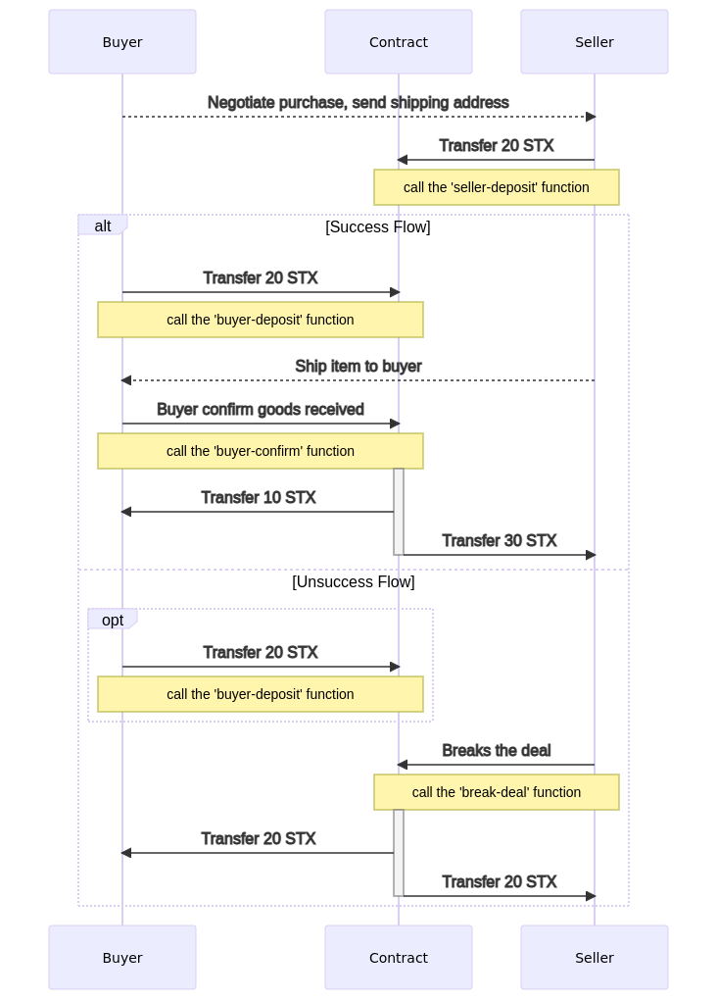

# Escrow Contract Extra Explanation

* Public function `seller-deposit` should be called first. Anyone who call that function became a `seller`
 and will be charged on provided as argument `x2price` amount.
* Public function `buyer-deposit` can be called by anyone  except one who called `seller-deposit` function.
 Anyone who called that function became a `buyer` and will be charged on amount setted by `seller` as `x2price`.
* Public function `break-deal` can be called only by `seller` at any time of the flow after calling function `seller-deposit`. If `seller` do not want to sell
 anything or do not have required product `seller` should have ability to break a deal even if `buyer` already transfered
 costs to deposit. `Seller` will pay the fee and costs paid by `seller` and `buyer` will be returned back to them.
* Public function `confirm-deal` can be called only by `buyer` only after public functions `seller-deposit` and `buyer-deposit` have been called.
 `Buyer` and `seller` at that point transfered to the contract 2 times of product price each so total amount on the contract deposit 4 times price of product.
  Because `buyer` should pay for the product, `buyer` will get only 1/2 of deposit costs and `seller` will get 3/2 of deposit costs.

  