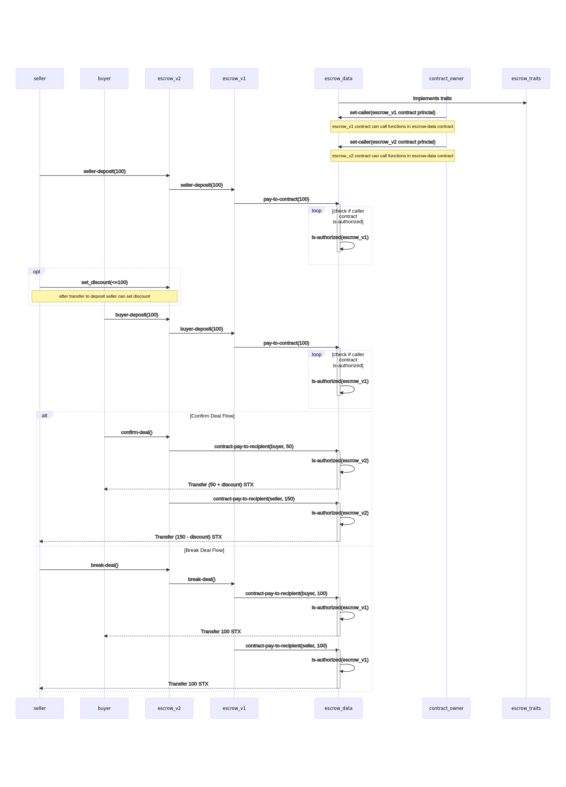

# App Data Contract Extra Explanation

* `escrow-data` contarct stores all order data, map of authorized contract principals and all payments as escrow contract.
* `escrow-v1` contract implements seller-deposit, buyer-deposit, break-deal and confirm-deal functions
* `escrow-v2` contracts differs from `escrow-v1` contract by the ability to set discount to the order and reuse functions seller-deposit, buyer-deposit and break-deal from `escrpw-v1` contract. Function confirm-deal is different from the v1 contract because it also implemets the logic of discount.
* Seller transfers to `escrow-data` contract 2 * price STXs
* After that seller optionally can set discount to the product price by calling function from `escrow-v2` contract
* After buyer transfered 2 * price STXs, buyer has ability to get back price of order and discount amount if Seller set such discount.

  