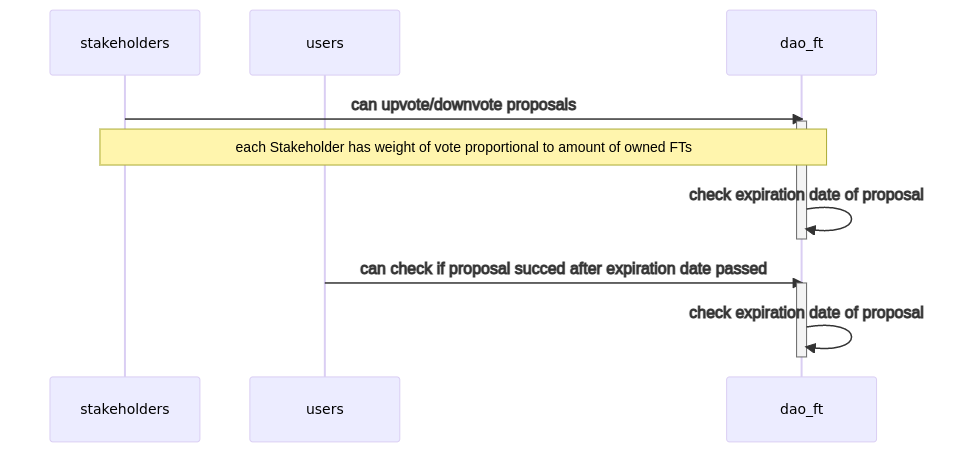

# DAO contract where fungible tokens is used as a vote for proposals.

* Users buy DAO ft to become Contributors.
* Contributors that have bought 100 or more fungible tokens are automatically made Stakeholders.
* Only a Stakeholder of the DAO can vote on proposals.
* Contributors and/or Stakeholders can create a new proposal.
* A newly created proposal has an ending date, when voting will conclude.
* Stakeholders can upvote or downvote a proposal.
* Once a Proposal's expiry date passes, anyone can get information if proposal succeed or not.

**_Flow how users can generate proposals in DAO_**

**_Flow how proposals can be voted and checked_**

