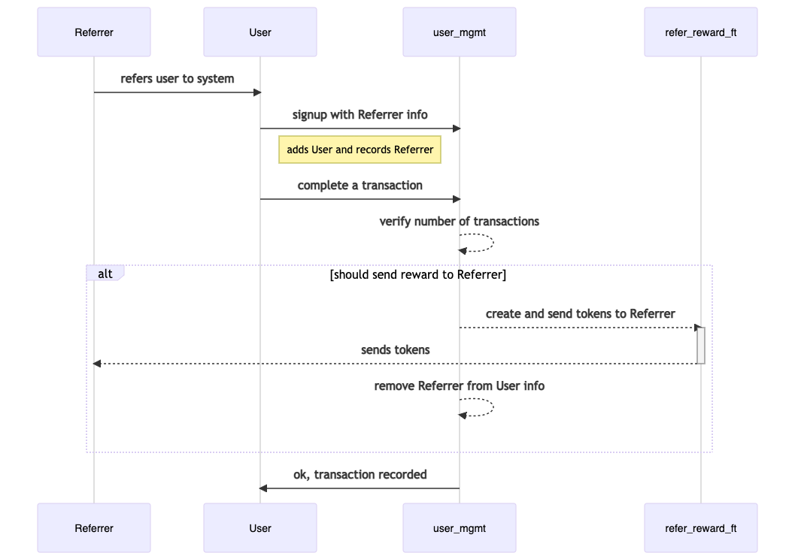

## Fungible tokens example 

This example implements SIP10 fungible token trait to create referral rewards. These reward tokens are transferred to referrers after new users signup and perform certain number of transactions.   

Example contains two contracts and an FT trait.  

### Files  

- **contracts/ft-traits.clar** 
    * defines traits for fungible tokens   
- **contracts/refer-reward-ft.clar**
    * implements ft-traits for refer-reward tokens 
- **contracts/user-mgmt.clar**
    * offers functions like signup, complete-transactions 
- **tests/*.ts**
    * contains test cases

### Testnet deployment

|Contract | Address|
|:---------|:--------|
|ft-trait | `ST2V7C1FR46HSV42S5XCZNJ80XE513E9526DGSC6E.ft-trait`|
|refer-reward-ft | `ST2V7C1FR46HSV42S5XCZNJ80XE513E9526DGSC6E.refer-reward-ft`|
|user-mgmt | `ST2V7C1FR46HSV42S5XCZNJ80XE513E9526DGSC6E.user-mgmt`|

### Flow 

Existing users can invite new users to system. On registeration, referrer address is saved alongwith new user info. Reward is only offered to referrer, if new user makes certain number of transactions in ssytem. Details of transactions are out of scope of this example. Currently transaction number is set to 1, for simplicity. 

Design key points 

- One User can invite multiple new users and will be rewarded for each one
- A user cannot refer her/himself
- Once a referrer is rewarded for a new user, its principal is removed from new user's info map
- Transactions are not reverted if refer-reward fails for any reason

*Flow of a call is described as following*

